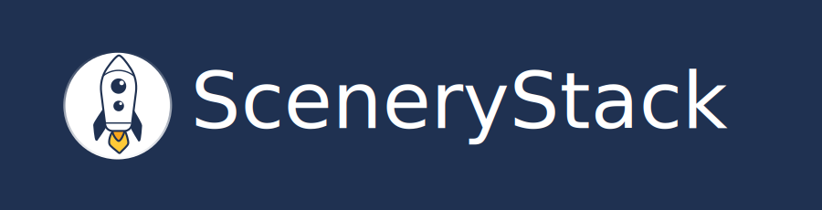

# SceneryStack Branding

Here are SceneryStack branding assets, used across the project pages, that you can use on your web project. All the assets provided are free to use (see [Licensing](./licensing.md)).

If you have any questions or specific requests, feel free to [submit an issue](https://github.com/scenerystack/community/issues/new).

See the [community GitHub repository](https://github.com/scenerystack/community/tree/main/docs/about/assets) for the raw files, some alternates, and PNG versions.

## Banner

## Logo

### Logo (Dark)

### Logo (Light)

## Logo - Monochrome (Dark)

## Logo - Monochrome (Light)

## Mark

### Mark (Dark)

### Mark (Light)

### Mark - Monochrome (Dark)

### Mark - Monochrome (Light)

