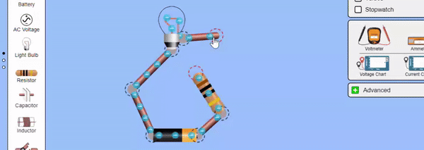

#  Welcome to the SceneryStack Developer Community

    
    
    

## What is SceneryStack?

 SceneryStack is a community built around a [collection of HTML5/TypeScript development libraries](./guides/scenerystack_list.md) in the Model-View-Controller framework that can be used **together or separately** to create a multimodal and accessible, web interactive. This includes support for robust accessibility features like dynamic and navigatable screen-reader descriptions. SceneryStack offers libraries specifically tailored to interactive, educational simulation development, in addition to being suitable for general web interactive development.
 
The development libraries were created by [PhET Interactive Simulations](https://phet.colorado.edu/) to create educational interactive simulations.

SceneryStack is in its early stages of becoming an independent community, distinct from PhET Interactive Simulations, and we're excited to see where it goes!

*[Interactive simulation](https://phet.colorado.edu/en/simulations/circuit-construction-kit-ac) created by PhET using SceneryStack*

<!-- TODO: VISION -->

## Why use SceneryStack?

Wondering why SceneryStack might be your go-to choice for creating and rendering interactive content on the web? While there are numerous libraries available, SceneryStack stands out with its unique offerings in flexibility and accessibility. If you're looking for a comprehensive, scalable, and up-to-date platform then SceneryStack is tailored for you!

### Core Features

- 🖥️ **Cross-Platform Capabilities**
- ⬇️ **Downloadable, Fully Offline, Single-File Artifacts**
- 🎨 **Pixel-Perfect Design & Color Profile Support**: Including optimization for high pixel density devices
- 🎭 **CSS Abstraction & Animation Support (Twixt)**
- 🔍 **TypeScript Integration** ensuring type safety & autocomplete
- 🔄 **Declarative APIs** for optimal performance/quality adjustments
- 🗑️ **Garbage Collector-Friendly Design** using pooling
- ⚡ **Real-Time Updates with Property.link (Axon)**
- 🖱️ **Enhanced Touch and Mouse Areas** and extended touch handling including Swipe-to-Snag functionality
- ⌨️ **Extendable Input System** that upholds foundational accessibility
- 🛠️ **Rich Component Library** with support for accessibiltiy and to build your own
- 🎬 **Support for Multiple Rendering** with seamless functionality across SVG, Canvas, and WebGL
- 📐 **Innovative Layout Engine** with advanced layout, shape computations, and CAG for interface components
- 🌍 **Ready for Internationalization** with examples of implementation
- 🖼️ **I-frame Support** for final project embedding anywhere across the web
- 📊 **Support for Charts and Graphs (Bamboo)**

### Accessibility Features

- 📖 **Parallel Document Object Model (PDOM)** ensuring screen reader accessibility ([Experience "Interactive Description"](https://youtu.be/gj55KDRdhM8))
- 🗣️ **Customizable, Dynamic Spoken Content** through Web Speech ([Experience "Voicing"](https://youtu.be/mwCc_NDmqx4))
- ⌨️ **API to Determine Keyboard Traversal Order**
- 🔍 **In-App Zooming Features**: Pinch-to-zoom and panning
- ⏹️ **Interactive Highlighting:** extends visual accessibility features inherent to keyboard/focus input to pointer/touch.
- 🔊 **Sound / Sonification:** Dedicated library (Tambo) for integrating Web Audio, including support for screen-focused audio and and sound modulation, as well as a library of UI sounds.

## Getting Started

Head over to [Guides](./guides/pathways.md) to choose your development path and get started.

## Joining the Community and Contributing 🤝

Looking to chat with others using SceneryStack, contribute to the community, or just need to ask some questions?

[🌍 Join the Community 🌍](join.md){ .md-button .md-button--primary }

## A few answers to some common questions...

??? question "What is this site and community for?"
    Discussions, resources, and collaboration around the use and improvement of **SceneryStack** and its [constituent libraries](./guides/scenerystack_list.md), maintained by the software developers at the PhET Interactive Simulations project.

    This repository is not for discussions and help regarding PhET's educational, interactive simulations. For questions and comments regarding PhET's simulations, please keep reading or see the [PhET Interactive Simulations website](https://phet.colorado.edu/) for more information.

<!-- ??? info "What is the relationship between SceneryStack and PhET Interactive Simulations?"
    SceneryStack is the HTML5/JavaScript/TypeScript APIs (detailed above) that PhET Interactive Simulations are built on. The use of SceneryStack **is not limited to creating interactive science and math simulations!** It can be used to support the creation of all web interactives. SceneryStack supports rich and inclusive multimodal interaction, including the architecture to build robust alternative input and screen reader access when used in conjunction with our [Interactive Description Design Framework](https://www.coursera.org/learn/description-design-for-interactive-learning-resources).

    PhET Interactive Simulations are free educational science and math products created using SceneryStack by the designers and developers at the PhET Interactive Simulations Project. They are developed using [research-based, pedagogically-minded, and inclusive design methods](https://phet.colorado.edu/). -->

??? question "I want to make an interactive simulation using SceneryStack! What should I do?"
    **If you are an individual or small group interested in or have made progress in making a new simulation:**
    The best resources available to you can be found in the [Development Overview](./info-sync/simulation-development-overview.md) and other documentation found or linked to on this site. Small test projects, academic projects (e.g., education research for a Ph.D.), or open source curriculum projects have all successfully developed custom simulations, leveraging our code base (See [Simulation Examples](./guides/simulation-examples.md)). It requires expertise in design and JavaScript/TypeScript, but it is very possible for dedicated developers and teams. If you have made significant progress and are committed to your STEM simulation, please reach out to us through the [community discussion forum](https://github.com/orgs/scenerystack/discussions) to discuss any support we may be able to provide.

    **If you are a commercial organization interested in making new simulations:**
    See the [PhET website page regarding simulation development](https://phet.colorado.edu/en/about/source-code) for more information.

??? question "What happens to my projects if these libraries stop being supported?"
    SceneryStack is the foundation of the PhET Interactive Simulations project. It is used in all of PhET's simulations and is actively maintained by the PhET team. PhET has no plans to stop supporting SceneryStack, so long as PhET Interactive Simulations continue to exist.

??? question "Do I have to brand my projects with PhET?"
    No! If you are creating a simulation, you can brand it however you like, but please contact us before using any PhET branding. See [Licensing](#licensing) below for more information.

    See the [brand](https://github.com/phetsims/brand) library for help creating your brand, as well as looking at the [Development Overview](./info-sync/simulation-development-overview.md).

??? question "Where can I get help or provide feedback for using a PhET Interactive Simulation?"
    For anything involving specific PhET Interactive Simulations, see the [PhET website](https://phet.colorado.edu).

    - To request **new PhET Simulations or new features in PhET Simulations**, follow the links on the [Getting Started section of the Help Center](https://phet.colorado.edu/en/help-center/guides#:~:text=I%20have%20a%20sim%20idea.%20Where%20can%20I%20send%20it%3F).
    - **For help or questions related to using PhET Simulations**, please see our [website](https://phet.colorado.edu/en/help-center/guides) or e-mail [phethelp@colorado.edu](mailto:phethelp@colorado.edu).
    - **To report a problem for a specific PhET Simulation**. Open the PhET menu on the navigation bar of the simulation and select “Report a Problem…” to submit a bug report using the provided form.

??? question "My question isn't here! Where can I find development specific questions?"
    Head over to [Frequently Asked Questions](./guides/faqs.md) in the Guides section for more questions specifically asked about developing in the SceneryStack framework.

*Interactive Music Video by @jessegreenberg (Github handle) using SceneryStack*

## Licensing

### SceneryStack
The libraries contained within the SceneryStack community, including `scenerystack/community`, are licensed via the MIT License and freely available for use by anyone. Authors using SceneryStack may choose any license for their creations.

??? warning "Licensing for PhET Interactive Simulations"
    The *simulation-specific source code* for PhET Interactive Simulations is typically GPLv3 licensed, but depends on the details of their development cycle (e.g., funding, partnerships, and third-party libraries).

    PhET does not engage in licensing *simulation-specific source code* to commercial entities at this time. Commercial partners interested in licensing a *Simulation* should see the PhET Interactive Simulations website for [partnership inquiries](https://phet.colorado.edu/en/partnerships).