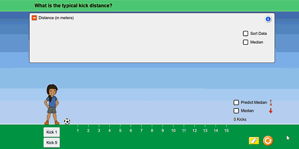
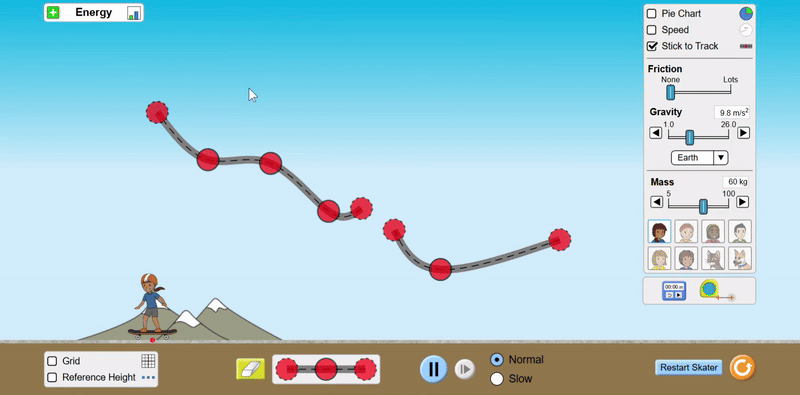

---
hide:
  - navigation
  - toc
---

# SceneryStack

<figure markdown>
[GET STARTED :octicons-rocket-24:{ .rocket }](./learn/overview.md){ .md-button .md-button--primary }
---
</figure>

## Create Highly Interactive Content for a Multimodal and Accessible Web

SceneryStack is an open-source TypeScript framework designed to create powerful, interactive, and accessible web experiences. SceneryStack offers web development libraries for building engaging simulations, educational tools, or next-generation web applications. Included is support for robust accessibility features like dynamic screen-reader descriptions and alternative input (e.g., keyboard navigation).

[**Learn about SceneryStack Capabilities**](#scenerystack-capabilities)

<iframe src="https://phet.colorado.edu/sims/html/friction/latest/friction_all.html" height="400" width="800" style="border:none;" title="Friction Simulation - made with SceneryStack"></iframe>
_[Interactive Physics Simulation with Inclusive Features](https://phet.colorado.edu/sims/html/friction/latest/friction_all.html) by @phetsims using SceneryStack_

---

SceneryStack was born from the work of [PhET Interactive Simulations](https://phet.colorado.edu/), where it powers STEM-focused interactives used by millions around the world. PhET continues to maintain and contribute to SceneryStack for the purposes of creating multimodal and accessible STEM interactives.
{==
**SceneryStack is in the early stages of transitioning to an independent open-source community, driven by a collective passion for a more people-friendly web.**
==}

---

## Ready to use SceneryStack?

<figure markdown>
[GET STARTED :octicons-rocket-24:{ .rocket }](./learn/setup.md){ .md-button .md-button--primary }
---
</figure>

Learn how to use SceneryStack in your web project or leverage the entire stack for your next highly interactive experience.

---

<figure markdown>
  
  <figcaption><a href="https://phet.colorado.edu/en/simulations/center-and-variability">Keyboard-friendly interactive simulation</a> created by @phetsims using SceneryStack</figcaption>
</figure>
---

## Community 🌍

Looking to chat with others using SceneryStack, contribute to the community, or just need to ask some questions?

<figure markdown>
[Join the Community](community/join.md){ .md-button .md-button--primary }
---
</figure>

---

<iframe src="https://jessegreenberg.github.io/cathedral/" height="400" width="800" style="border:none;" title="Cathedral - made with SceneryStack"></iframe>

_[Interactive Music Video](https://jessegreenberg.github.io/cathedral/) by @jessegreenberg using SceneryStack_

---

## Accessibility and Inclusive Features

Want to learn more about the Accessibility and Inclusive Design features of SceneryStack and how to create accessible content for all users?

<figure markdown>
[:octicons-rocket-24: Learn about Accessibility and Inclusive Design](./accessibility/a11y_guides.md){ .md-button .md-button--primary }
---
</figure>

---

<figure markdown>
  
  <figcaption><a href="https://phet.colorado.edu/en/simulations/energy-skate-park">Energy Skate Park</a>, dynamic and game-like simulation created by @phetsims using SceneryStack</figcaption>
</figure>

---

## Contributing 🤝

We welcome contributions from the community! Whether you're a seasoned developer or just starting, there are many ways to contribute to SceneryStack.

<figure markdown>
[Help Develop SceneryStack](./CONTRIBUTING.md){ .md-button .md-button--primary }
---
</figure>

## SceneryStack Capabilities

| _Rendering and Data Handling_ | _Input and Accessibility Features_ |
|-----------------------------|----------------------------------|
| **Cross-Platform Capabilities**: Shield from bugs and quirks of modern browsers. | **Screen Reader Access**: Novel and effective access using the research-backed Parallel Document Object Model (PDOM) ([Experience "Interactive Description"](https://youtu.be/gj55KDRdhM8)). |
| **Offline Support**: Downloadable, fully offline, single-file artifacts. | **Dynamic Spoken Content**: Customizable through Web Speech ([Experience "Voicing"](https://youtu.be/mwCc_NDmqx4)). |
| **Pixel-Perfect Design**: Optimized for high pixel density devices with color profile support. | **Interactive Highlighting**: Extends visual accessibility features to pointer/touch input. |
| **CSS Abstraction & Animation**: Utilize the `Twixt` library for advanced animations. | **In-App Zooming**: Features like pinch-to-zoom and panning. |
| **TypeScript Integration**: Ensures type safety and autocomplete. | **Multimodal Libraries**: Integrate Web Audio with `Tambo`, computer vision with `Tangible`, and experimental Vibration API support with `Tappi`. |
| **Real-Time Updates**: Trace dependencies and updates using the `Axon` library. | **Enhanced Touch and Mouse Areas**: Extended touch handling including Swipe-to-Snag functionality. |
| **Rich Component Library**: Build accessible components with ease. | **Extendable Input System**: Upholds foundational accessibility. |
| **Multiple Rendering Support**: Seamless functionality across SVG, Canvas, and increasing WebGL support. | **Keyboard Traversal Order**: API to specify keyboard traversal order. |
| **Innovative Layout Engine**: Advanced layout, shape computations, and CAG for interface components. | |
| **Enhanced iframe Support**: Easier user interaction within iframes. | |
| **Charts and Graphs**: Support using the `Bamboo` library. | |
| **Declarative APIs**: Optimize performance and quality adjustments. | |

**SceneryStack is also ready to be implemented with your favorite JS libraries and frameworks, such as React, Three.js, and more.**

---

<figure markdown>
  
  <figcaption><a href="https://phet.colorado.edu/en/simulations/circuit-construction-kit-dc">Circuit Construction Kit</a>, circuit sandbox simulation created by @phetsims using SceneryStack</figcaption>
</figure>
