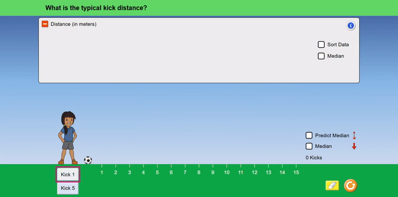

---
hide:
  - navigation
  - toc
---

# SceneryStack

## Create Highly Interactive Content for a Multimodal and Accessible Web

SceneryStack is an open-source Typescript framework for developing multimodal, accessible HTML5 web interactives. SceneryStack offers libraries suitable for general web interactive development, as well as those specifically tailored toward creating interactive simulations. Included is support for robust accessibility features like dynamic screen-reader descriptions and alternative input (e.g., keyboard navigation).
<!-- TODO: expand on accessibility, inc PDOM and abstraction for descriptions -->

[GET STARTED :octicons-rocket-24:{ .rocket }](./guides/pathways.md){ .md-button .md-button--primary }
---

---

<figure markdown>
  
  <figcaption><a href="https://phet.colorado.edu/en/simulations/energy-skate-park">PhET Interactive Simulation</a> created using SceneryStack</figcaption>
</figure>

---

The development libraries within SceneryStack were originally created by [PhET Interactive Simulations](https://phet.colorado.edu/) to create educational interactive simulations. PhET continues to maintain and contribute to SceneryStack for the purposes of creating multimodal and accessible STEM interactives.

{==
**SceneryStack is in the early stages of transitioning to an independent open-source community, driven by a collective passion for a more people-friendly web.**
==}

## Flexibility and Accessibility

### Rendering and Graphics

- **Cross-Platform Capabilities**: Shield from bugs and quirks of modern browsers.
- **Offline Support**: Downloadable, fully offline, single-file artifacts.
- **Pixel-Perfect Design**: Optimized for high pixel density devices with color profile support.
- **CSS Abstraction & Animation**: Utilize the `Twixt` library for advanced animations.
- **TypeScript Integration**: Ensures type safety and autocomplete.
- **Real-Time Updates**: Trace dependencies and updates using the `Axon` library.
- **Rich Component Library**: Build accessible components with ease.
- **Multiple Rendering Support**: Seamless functionality across SVG, Canvas, and increasing WebGL support.
- **Innovative Layout Engine**: Advanced layout, shape computations, and CAG for interface components.
- **Enhanced iframe Support**: Easier user interaction within iframes.
- **Charts and Graphs**: Support using the `Bamboo` library.
- **Declarative APIs**: Optimize performance and quality adjustments.

### Input

- **Enhanced Touch and Mouse Areas**: Extended touch handling including Swipe-to-Snag functionality.
- **Extendable Input System**: Upholds foundational accessibility.
- **Keyboard Traversal Order**: API to specify keyboard traversal order.

### Accessibility and Inclusive Features

- **Screen Reader Access**: Novel and effective access using the research-backed Parallel Document Object Model (PDOM) ([Experience "Interactive Description"](https://youtu.be/gj55KDRdhM8)).
- **Dynamic Spoken Content**: Customizable through Web Speech ([Experience "Voicing"](https://youtu.be/mwCc_NDmqx4)).
- **Interactive Highlighting**: Extends visual accessibility features to pointer/touch input.
- **In-App Zooming**: Features like pinch-to-zoom and panning.
- **Multimodal Libraries**: Integrate Web Audio with `Tambo`, computer vision with `Tangible`, and experimental Vibration API support with `Tappi`.

SceneryStack is also ready to be implemented with your favorite JS libraries and frameworks, such as React, Three.js, and more.

## Getting Started

[GET STARTED :octicons-rocket-24:{ .rocket }](./guides/pathways.md){ .md-button .md-button--primary }
---

Learn how to use SceneryStack in your web project or leverage the entire stack for your next highly interactive experience.

Choose your development path and [get started](./guides/pathways.md).

---

<figure markdown>
  
  <figcaption><a href="https://phet.colorado.edu/en/simulations/center-and-variability">Keyboard capable interactive simulation</a> created using SceneryStack</figcaption>
</figure>
---

## Community and Contributing 🤝

Looking to chat with others using SceneryStack, contribute to the community, or just need to ask some questions?

[🌍 Join the Community 🌍](join.md){ .md-button .md-button--primary }

## FAQs

Head over to [Frequently Asked Questions](./guides/faqs.md) for questions asked about developing in the SceneryStack framework and SceneryStack generally.

---

<iframe src="https://jessegreenberg.github.io/cathedral/" height="400" width="800" style="border:none;" title="Cathedral - made with SceneryStack"></iframe>

_[Interactive Music Video](https://jessegreenberg.github.io/cathedral/) by @jessegreenberg using SceneryStack - Try it here in the browser!_

---

## License

The libraries contained within SceneryStack, including this website, are under the MIT License and freely available for use by anyone. Authors using SceneryStack may choose any license for their creations.

??? warning "Licensing for PhET Interactive Simulations"
     The _simulation source code_ for PhET Interactive Simulations is typically GPLv3 licensed or similar. For everything involving PhET Interactive Simulations, including partnerships, [see their website](https://phet.colorado.edu/).

---

_[Interactive simulation](https://phet.colorado.edu/en/simulations/circuit-construction-kit-dc) created by PhET using SceneryStack_
