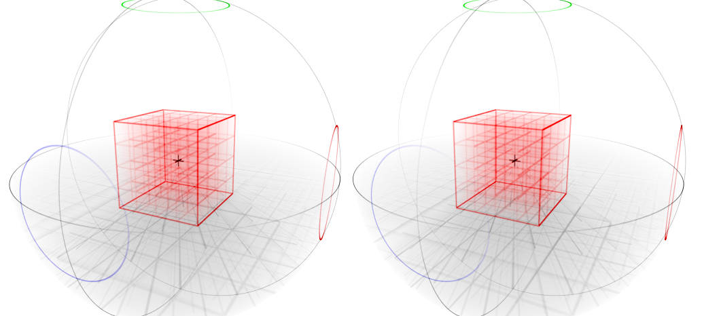

# Showcase

## Cathedral

:fontawesome-brands-github: [Cathedral - Interactive music video by @jessegreenberg](https://github.com/jessegreenberg/cathedral)

[Try Cathedral](https://jessegreenberg.github.io/cathedral/){ .md-button }

## Optimal Wordle Solutions

:fontawesome-brands-github: [Optimal Wordle Solutions by @jonathanolson](https://jonathanolson.net/experiments/optimal-wordle-solutions)

[Try WordleSolver](https://jonathanolson.net/experiments/optimal-wordle-solutions){ .md-button }

## Paper Playground

:fontawesome-brands-github: [Paper Playground - A multimodal, collaborative web interaction design tool](https://github.com/phetsims/paper-land/)

## Haptics Playground

:fontawesome-brands-github: [Haptics Playground - an HTML5 vibration pattern explorer by @jbphet](https://github.com/phetsims/quake/)

## Ring Attack Solo

:fontawesome-solid-globe: [Ring Attack Solo by @jonathanolson](https://jonathanolson.net/miscworks/build/ring-attack-solo.html)

## 4D visualization with 3D images

:fontawesome-solid-globe: [4D visualization with 3D images by @jonathanolson](https://jonathanolson.net/miscworks/build/fourtest.html)

## Rubik's Cube searchable algorithms

:fontawesome-solid-globe: [Rubik's Cube searchable algorithms page by @jonathanolson](https://jonathanolson.net/miscworks/build/rubik_algorithms.html)

## Cupcake Snake Game

:fontawesome-brands-github: [Cupcake Snake Game by @samreid](https://github.com/samreid/cupcake-snake)

## Simplified manual for "Keep Talking and Nobody Explodes"

:fontawesome-solid-globe: [Simplified manual for "Keep Talking and Nobody Explodes" game by @jonathanolson](https://jonathanolson.net/miscworks/build/ktane.html)

## Letterboxing Tool

:fontawesome-solid-globe: [Letterboxing Tool by @jonathanolson](https://jonathanolson.net/miscworks/build/boxing.html)

## Simple Scenery examples

:fontawesome-solid-globe: [Simple Scenery examples](https://phetsims.github.io/scenery/examples/)

## More examples

!!! success "Add yours here!"
    Creating something? Let us know and get your project added here!

For more complete examples, including full accessibility features, see the [Simulation Showcase](../examples/simulation-showcase.md) page.
