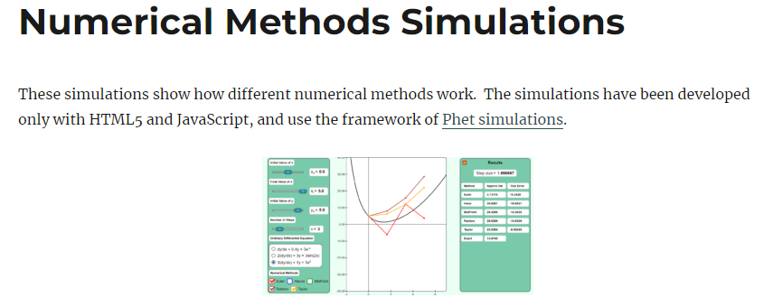
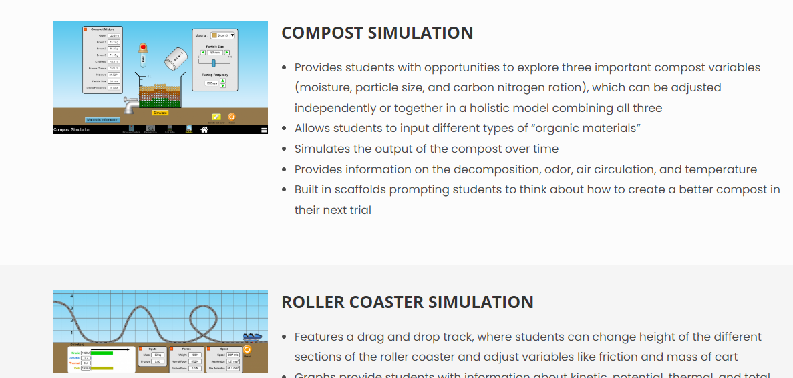
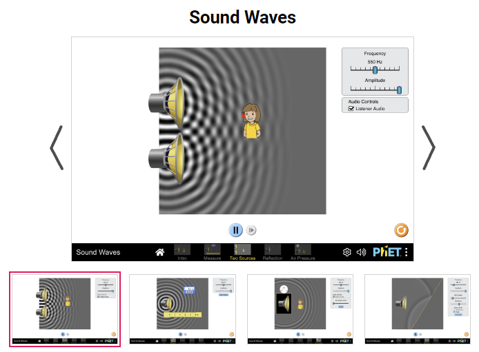
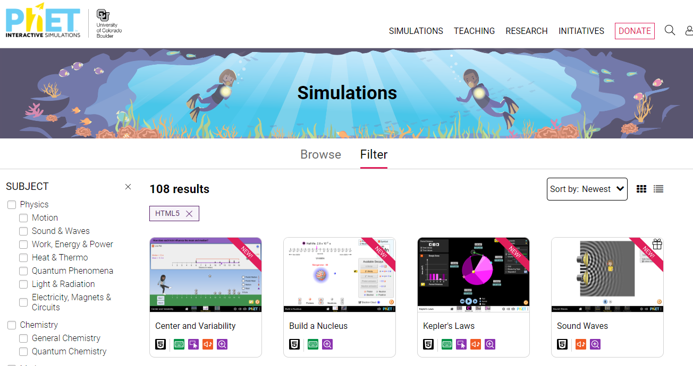

--8<-- "api-reference-snippets.md"

# Simulation Showcase

## Community Simulations

### Numerical Methods Simulations

:fontawesome-solid-globe: [Numerical Methods Simulations by Autar Kaw](https://nm.mathforcollege.com/numericalmethodssimulations/)

!!! abstract
    

### Interactive Learning & Design Lab (University of Wisconsin)

:fontawesome-solid-globe: [ILDL Simulations](https://ildl.wceruw.org/technology-simulations/)

### Sound Waves Simulation

:fontawesome-brands-github: [Sound Waves simulation](https://github.com/phetsims/sound-waves) (ported by Piet Goris, published by PhET)

:fontawesome-solid-globe: [Sound Waves Sim Page](https://phet.colorado.edu/en/simulations/sound-waves)

## PhET Interactive Simulations

:fontawesome-brands-github: [all PhET Interactive Simulations simulation repositories](https://github.com/orgs/phetsims/repositories?q=license%3Agpl)

:fontawesome-solid-globe: [PhET Interactive Simulation Filter Page](https://phet.colorado.edu/en/simulations/filter?type=html)

## Community Projects

### Instructional Interface Wrapper

:fontawesome-brands-github: [Instructional Interface for PhET Simulations](https://github.com/COMP-523-Team-D/PhysicsSimulation)

### PhET Developer Helper CLI - npm package

:fontawesome-solid-globe: [PhET Developer Helper CLI npm package](https://www.npmjs.com/package/phet-dev-cli)
